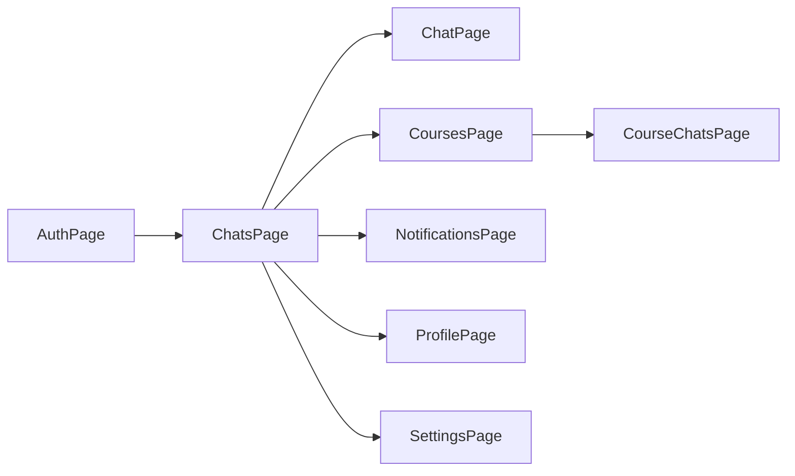

## Структура фронтенда мессенджера

Ниже — список основных страниц и компонентов для браузерного приложения мессенджера онлайн‑школы, спроектированный так, чтобы логику и UI легко было переиспользовать в мобильном приложении.

---

## 1. Общие базовые компоненты

- `**Layout` (базовый каркас приложения)**
  - Верхняя панель с логотипом школы и иконками профиля/уведомлений.
  - Основная область контента (меняется в зависимости от страницы).
  - В мобильной версии — нижнее таб‑меню (чаты / курсы / профиль / настройки).
- `**Sidebar` / список чатов**
  - Поиск по чатам.
  - Фильтры: «Все», «Личные», «Групповые», «По курсам».
  - Список чатов с:
    - названием чата / именем собеседника;
    - последним сообщением (обрезка по длине);
    - временем последнего сообщения;
    - счетчиком непрочитанных.
- `**ChatItem` (элемент списка чатов)**
  - Аватар (курс / пользователь).
  - Название чата.
  - Иконка, если чат закреплён или заглушен.
  - Индикатор онлайн‑статуса собеседника (для личных чатов).
- `**MessageBubble` (сообщение)**
  - Текст сообщения.
  - Прикреплённые файлы (иконы файла/картинки/видео, название, размер).
  - Время отправки.
  - Статус доставки (отправлено/доставлено/прочитано — пока как статический UI).
  - Индикатор «это вы» (выравнивание справа, свой цвет).
- `**MessageInput` (поле ввода сообщения)**
  - Многострочное поле ввода.
  - Кнопка отправки.
  - Кнопки вложений: файл, изображение, голосовое (пока заглушки).
  - Подсказка, если пользователь не имеет права писать (например, заблокирован).
- `**TypingIndicator` (кто-то печатает)**
  - Маленький индикатор «Куратор печатает…».
- `**UserAvatar`, `UserTag`**
  - Аватар с инициалами, если нет картинки.
  - Маленький бейдж с ролью: «Куратор», «Ученик».
- `**Toast` / уведомления в интерфейсе**
  - Сообщения об ошибках/успехе (например, «Сообщение не отправлено, попробуйте ещё раз» — пока фронтовая заглушка).

---

## 2. Страница регистрации и входа

### 2.1. Страница «Вход / Регистрация» (`/auth`)

**Что видит пользователь:**

- Логотип онлайн‑школы и короткое описание сервиса.
- Переключатель вкладок: «Вход» / «Регистрация».

**Компоненты:**

- `**AuthLayout`** — обёртка с фоном/картинкой, карточкой формы.
- `**LoginForm`**
  - Поля: email / телефон, пароль.
  - Чекбокс «Запомнить меня».
  - Кнопка «Войти».
  - Ссылка «Забыли пароль?» (пока без реальной логики).
- `**RegisterForm`**
  - Поля: имя, фамилия, email/телефон, пароль, подтверждение пароля.
  - Выпадающий список «Кто вы?» (Ученик / Куратор / Админ — по желанию).
  - Чекбокс согласия с политикой конфиденциальности.
  - Кнопка «Зарегистрироваться».
- `**AuthHint`** — текстовые подсказки («После регистрации куратор добавит вас в чаты курса»).

**Данные на странице:**

- Локальные состояния форм (значения полей, ошибки валидации).
- Состояние загрузки кнопки (имитация запроса).

---

## 3. Главная страница после входа — список чатов

### 3.1. Страница «Чаты» (`/chats` — главная)

**Что видит пользователь:**

- В десктопной версии:
  - Слева — `Sidebar` со списком всех чатов.
  - Справа — заглушка «Выберите чат» или последний открытый чат.
- В мобильной версии:
  - Вкладка «Чаты» с полноэкранным списком чатов.

**Компоненты:**

- `**ChatListPage`**
  - Встроенный `Sidebar`.
  - Верхняя панель с:
    - полем поиска по чатам;
    - кнопкой «+ Новый чат».
- `**NewChatModal`** (модальное окно создания чата)
  - Переключатель «Личный» / «Групповой» чат.
  - Поле ввода названия (для групповых чатов).
  - Выбор участников (пока как плоский список с чекбоксами или тег‑input).
  - Переключатель «Чат привязан к курсу?» (выбор курса из списка, если нужно).

**Данные на странице:**

- Список «моковых» чатов (id, название, тип, курс, участники, последний месседж, время, непрочитанные).
- Текущее состояние фильтров и поиска.

---

## 4. Страница конкретного чата

### 4.1. Страница «Чат» (`/chats/:chatId`)

**Что видит пользователь:**

- В десктопной версии:
  - Слева: `Sidebar` со списком чатов.
  - Справа: область активного чата.
- Внутри области чата:
  - Верхняя панель:
    - Название чата / имя собеседника.
    - Аватар/иконка курса.
    - Кол-во участников (для группового), кликабельно.
    - Кнопки: «Информация о чате», «Поиск по сообщениям», «Заглушить уведомления».
  - Область сообщений:
    - Список `MessageBubble`.
    - Маркеры «Новые сообщения», «Сегодня», «Вчера».
    - Индикатор «куратор печатает…» при необходимости.
  - Нижняя панель — `MessageInput`.

**Компоненты:**

- `**ChatPage`** — контейнер страницы.
- `**ChatHeader`** — верхняя панель чата.
- `**MessageList`** — скроллируемый список сообщений.
- `**MessageBubble`** — 2 варианта (свои и чужие сообщения).
- `**MessageInput`** — поле ввода.
- `**ChatInfoPanel` / `ChatInfoDrawer`**
  - В десктопе — боковая панель справа.
  - В мобильной версии — выезжающая снизу панель/экран.

**Что видит пользователь в `ChatInfo` (информация о чате):**

- Название и описание чата.
- Тип чата: личный / групповой / чат курса.
- Список участников с аватарами и ролями (куратор / ученик).
- Настройки уведомлений для этого чата (вкл/выкл).
- Кнопка «Выйти из чата» (если это позволено ролью).

**Данные на странице:**

- Текущий чат (метаданные).
- Список сообщений (автор, текст, время, статусы, вложения).
- Текущий пользователь (id, имя, роль) — для визуального разграничения.

---

## 5. Страница профиля пользователя

### 5.1. Страница «Профиль» (`/profile`)

**Что видит пользователь:**

- Своё имя и фамилию.
- Аватар (с возможностью загрузки — пока UI без реальной загрузки).
- Роль (Ученик / Куратор).
- Контактные данные: email, телефон.
- Список курсов/групп, к которым он подключен.
- Настройки приватности (например, «разрешить личные сообщения от других учеников» — пока фронтовый свитч).

**Компоненты:**

- `**ProfilePage`** — контейнер.
- `**ProfileHeader`** — аватар + имя + роль.
- `**ProfileForm`** — редактирование контактных данных.
- `**CoursesList`** — список курсов пользователя.
- `**PrivacySettings`** — переключатели приватности.

**Данные на странице:**

- Информация о текущем пользователе (mock).
- Список курсов (название, статус, роль в курсе).

---

## 6. Страница уведомлений

### 6.1. Страница «Уведомления» (`/notifications`)

**Что видит пользователь:**

- Список последних событий:
  - «Новое сообщение от куратора в чате курса X».
  - «Вас добавили в чат группы Y».
- Фильтры: «Все», «Только упоминания», «Системные».
- Кнопка «Отметить всё как прочитанное».

**Компоненты:**

- `**NotificationsPage`**
- `**NotificationItem`** (тип уведомления, текст, время, статус прочитано/непрочитано).
- В шапке приложения — иконка колокольчика с бейджем количества непрочитанных.

**Данные на странице:**

- Список уведомлений (тип, текст, привязанный чат/сообщение, время, статус).

---

## 7. Страница списка курсов и чатов по курсу (опционально, но полезно для онлайн‑школы)

### 7.1. Страница «Мои курсы» (`/courses`)

**Что видит пользователь:**

- Список курсов, в которых он участвует.
- Для каждого курса:
  - Название курса.
  - Преподаватель/куратор.
  - Статус (идёт сейчас / завершён / планируется).
  - Кнопка «Перейти к чатам курса».

**Компоненты:**

- `**CoursesPage`**.
- `**CourseCard`** — карточка курса.

### 7.2. Страница «Чаты курса» (`/courses/:courseId/chats`)

**Что видит пользователь:**

- Список чатов, связанных с конкретным курсом:
  - Общий чат курса.
  - Чаты по модулям.
  - Личные чаты с кураторами этого курса.

**Компоненты:**

- `**CourseChatsPage`**.
- Переиспользуемый список чатов (`ChatList`), отфильтрованный по курсу.

**Данные на странице:**

- Информация о курсе и его чатах.

---

## 8. Страница настроек

### 8.1. Страница «Настройки» (`/settings`)

**Что видит пользователь:**

- Общие настройки приложения:
  - Тема (светлая/тёмная).
  - Язык.
  - Включение/отключение звуковых уведомлений.
  - Настройки уведомлений по умолчанию для новых чатов.
- Настройки безопасности:
  - Переключатели видимости профиля.
  - Смена пароля (пока UI).

**Компоненты:**

- `**SettingsPage`**.
- `**ThemeSwitcher`**.
- `**LanguageSelector`**.
- `**NotificationSettings`**.
- `**SecuritySettings`**.

**Данные на странице:**

- Локальное состояние настроек (можно хранить в `localStorage` в дальнейшем).

---

## 9. Страница 404 / техническая заглушка

### 9.1. Страница «Не найдено / Ошибка» (`/404`)

**Что видит пользователь:**

- Сообщение «Страница не найдена» или «Сервис временно недоступен».
- Кнопка «Вернуться в чаты».

**Компоненты:**

- `**NotFoundPage`**.
- `**ErrorState`** (можно переиспользовать для разных ошибок).

---

## 10. Взаимосвязи страниц (упрощённо)

---

## 11. Минимальный первичный приоритет

Чтобы стартовать прототип, можно сначала реализовать:

- **AuthPage** (`/auth`).
- **ChatsPage + ChatPage** с базовой структурой (`Sidebar`, `MessageList`, `MessageInput`).
- **ProfilePage** с отображением пользователя.
- **Notifications** как простую иконку и страницу со списком.

Остальные страницы (курсы, расширенные настройки) можно добавить на следующих итерациях.